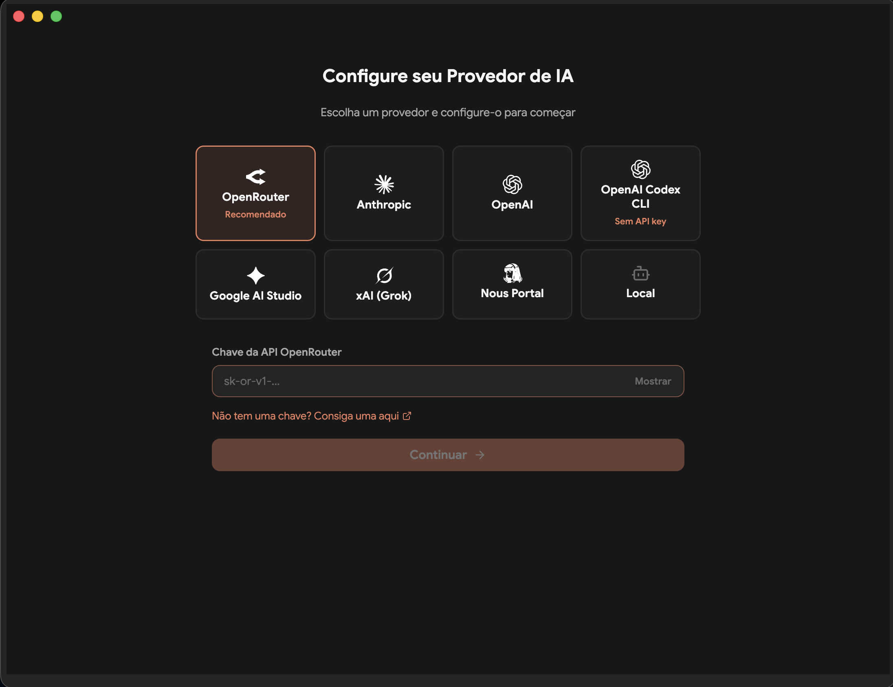
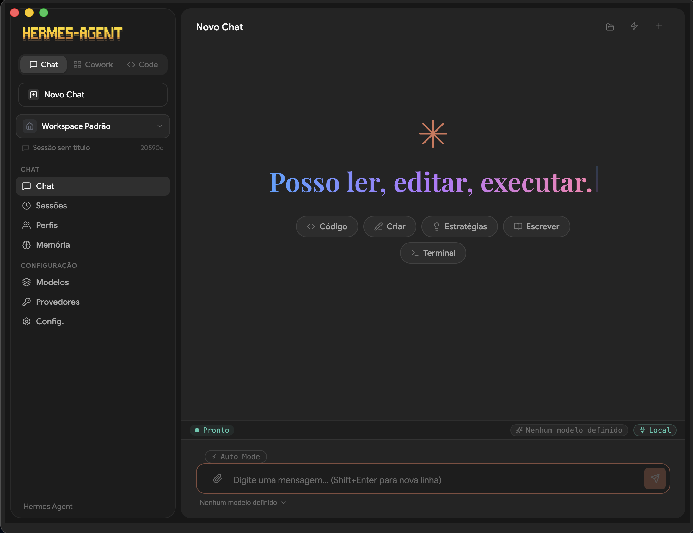
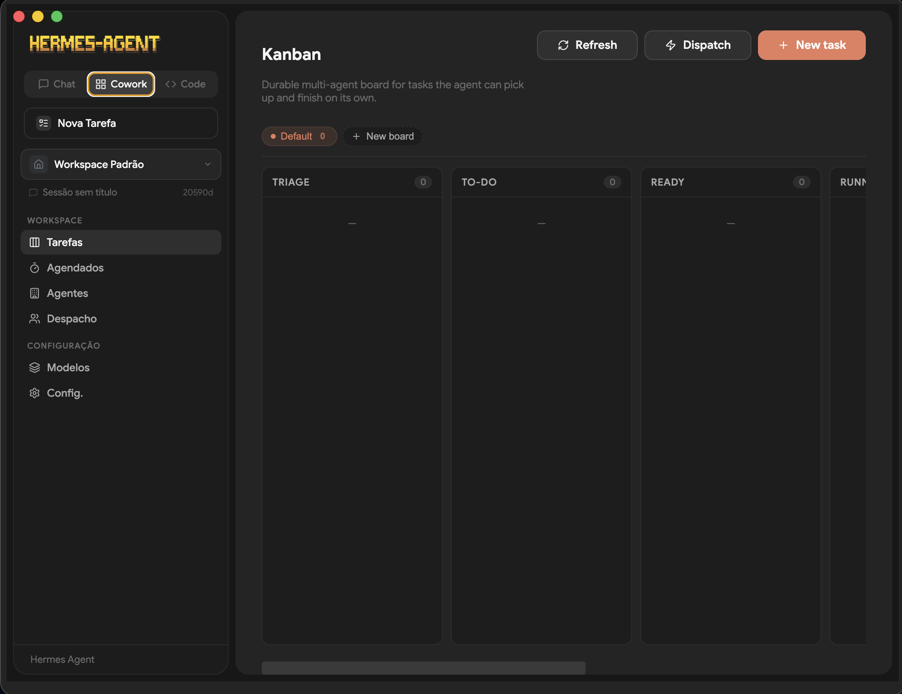
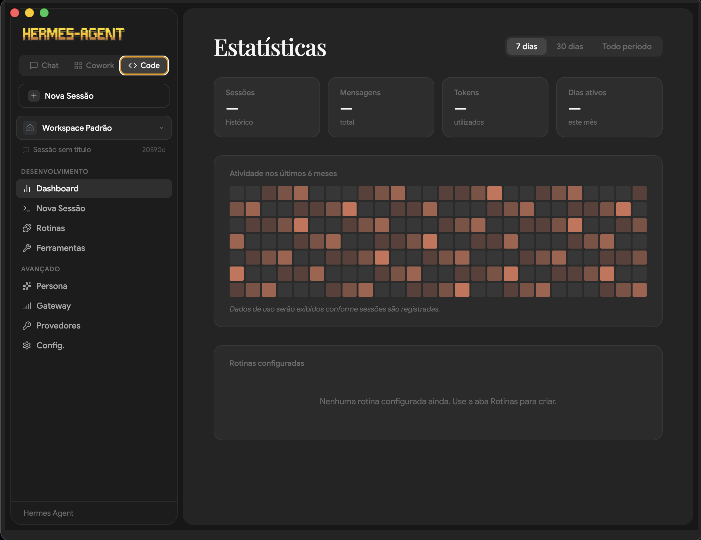

# Hermes Agent

**Hermes Agent** é um desktop de IA autônomo construído com Electron, React e TypeScript. Conecta múltiplos provedores de IA, executa agentes com acesso a ferramentas reais, gerencia workspaces isolados e orquestra tarefas multi-agente — tudo em uma interface premium de sistema operacional de IA.

---

## Capturas de tela

| Configuração de Provedor | Interface de Chat |
|:---:|:---:|
|  |  |

| Cowork — Kanban Multi-agente | Code — Dashboard de Estatísticas |
|:---:|:---:|
|  |  |

---

## Funcionalidades

### Modos de interface
- **Chat** — Conversação com qualquer modelo de IA, sessões persistidas, memória holográfica ativa por padrão
- **Cowork** — Quadro Kanban multi-agente (TRIAGE → TO-DO → READY → RUNNING → DONE), despacho de agentes, agendamentos
- **Code** — Dashboard de estatísticas de uso, heatmap de atividade 6 meses, rotinas automatizadas, ferramentas e gateway

### Provedores de IA suportados

| Provedor | API Key | Notas |
|---|---|---|
| OpenRouter | `sk-or-v1-...` | Recomendado — acesso a 200+ modelos |
| Anthropic | `sk-ant-...` | Claude 3.5 / Claude 4 |
| OpenAI | `sk-...` | GPT-4o, o3, o4-mini |
| OpenAI Codex CLI | — | Sem API key necessária |
| Google AI Studio | `AIza...` | Gemini 2.0 / 2.5 |
| xAI (Grok) | `xai-...` | Grok 3 |
| Nous Portal | `nousresearch-...` | Modelos Hermes |
| Local (Ollama) | — | Qualquer modelo local |
| DeepSeek (proxy) | — | Via DeepsProxy com auth Chromium |

### Agentes e ferramentas
- **269+ habilidades** disponíveis globalmente para todos os workspaces
- **MCP Servers** — conexão a qualquer servidor Model Context Protocol via stdio ou HTTP
- **Skills** — plugins Python por categoria (browser, dados, devops, GitHub, mídia, etc.)
- **Claw3D** — interface de escritório 3D integrada (Next.js, porta 4001–4100 automática)
- **DeepsProxy** — proxy OpenAI-compatible para DeepSeek R1 com autenticação via Chromium
- **Gateway** — API REST local para acesso externo ao agente
- **Memória holográfica** — ativa por padrão em todos os workspaces
- **Soul** — persona e instrução de sistema customizável por workspace
- **Schedules** — tarefas agendadas com cron

---

## Stack técnica

```
Electron 39.8.5       — shell nativo macOS / Windows / Linux
React 19              — UI reativa
TypeScript 5          — tipagem end-to-end (main + preload + renderer)
electron-vite         — build otimizado (HMR em dev, bundles em prod)
Tailwind 4 (custom)   — sistema de CSS com variáveis premium
Framer Motion 12      — animações de interface
Lucide Icons          — ícones SVG consistentes
Playwright            — automação de browser (DeepsProxy)
Python 3              — runtime dos agentes, skills e plugins
SQLite                — sessões, kanban, memória
```

---

## Requisitos

| Dependência | Versão mínima |
|---|---|
| Node.js | 20+ |
| npm | 10+ |
| Python | 3.10+ |
| macOS | 13+ (arm64 / x64) |

---

## Instalação

### 1. Clonar o repositório

```bash
git clone https://github.com/webchk/hermes-agent.git
cd hermes-agent
```

### 2. Instalar dependências

```bash
npm install
```

### 3. Executar em modo de desenvolvimento

```bash
npm run dev
```

### 4. Build e empacotamento (macOS)

```bash
# Build de produção
npm run build

# Empacotar app
npx electron-builder --dir --mac

# Instalar em /Applications
rm -rf "/Applications/Hermes Agent.app"
cp -R "dist/mac-arm64/Hermes Agent.app" /Applications/
open "/Applications/Hermes Agent.app"
```

---

## Configuração de provedores

### OpenRouter (recomendado)

1. Acesse [openrouter.ai](https://openrouter.ai) e crie uma conta
2. Gere uma API key em **Keys**
3. No Hermes Agent: tela inicial → selecione **OpenRouter** → cole a key → **Continuar**

### Anthropic

1. Acesse [console.anthropic.com](https://console.anthropic.com)
2. Gere uma key em **API Keys**
3. No Hermes Agent: selecione **Anthropic** → cole a key

### OpenAI

1. Acesse [platform.openai.com](https://platform.openai.com)
2. Gere uma key em **API keys**
3. No Hermes Agent: selecione **OpenAI** → cole a key

### Google AI Studio

1. Acesse [aistudio.google.com](https://aistudio.google.com)
2. Clique em **Get API key**
3. No Hermes Agent: selecione **Google AI Studio** → cole a key

### Local (Ollama)

1. Instale o [Ollama](https://ollama.ai): `brew install ollama`
2. Baixe um modelo: `ollama pull llama3.2`
3. No Hermes Agent: selecione **Local** — detecta automaticamente em `localhost:11434`

### DeepSeek via DeepsProxy

1. No Hermes Agent: **Provedores** → **DeepsProxy** → **Login**
2. O Chromium abre para autenticação no deepseek.com
3. Após login, o navegador fecha e o proxy inicia automaticamente
4. Porta alocada automaticamente entre 3500–4000

---

## Portas e serviços

| Serviço | Porta | Notas |
|---|---|---|
| Gateway (API REST) | `4201` | API local para acesso externo |
| DeepsProxy | `3500–4000` | Proxy OpenAI-compatible para DeepSeek |
| Claw3D | `4001–4100` | Interface escritório 3D Next.js |
| Claw3D Adapter | `18789` | Adaptador WebSocket Hermes ↔ Claw3D |
| Ollama | `11434` | Runtime de modelos locais |

Todas as portas dinâmicas são detectadas automaticamente — sem conflito com outros serviços.

---

## MCP Servers (Model Context Protocol)

Adicione servidores MCP em `~/.hermes/config.yaml`:

```yaml
mcp_servers:
  filesystem:
    command: npx
    args: ["-y", "@modelcontextprotocol/server-filesystem", "/Users/voce/projetos"]
    enabled: true

  github:
    command: npx
    args: ["-y", "@modelcontextprotocol/server-github"]
    env:
      GITHUB_PERSONAL_ACCESS_TOKEN: "seu-token"
    enabled: true

  playwright:
    command: npx
    args: ["-y", "@modelcontextprotocol/server-playwright"]
    enabled: true
```

MCPs em `~/.hermes/config.yaml` ficam disponíveis para **todos** os workspaces automaticamente.

---

## Skills (habilidades)

Skills são plugins Python organizados em `~/.hermes/skills/<categoria>/<nome>/`.

Todos os workspaces herdam as skills globais. Skills por workspace ficam em `~/.hermes/profiles/<nome>/skills/`.

| Categoria | Descrição |
|---|---|
| `browser-automation` | Controle de navegador via Playwright |
| `agency-agents` | Agentes autônomos especializados |
| `devops` | CI/CD, Docker, infraestrutura |
| `data-science` | Análise de dados, pandas, visualização |
| `mcp` | Integração com servidores MCP |
| `creative` | Escrita criativa e conteúdo |
| `github` | Integração com GitHub |
| `mlops` | Machine learning operations |
| `research` | Pesquisa e síntese de informações |
| `productivity` | Automações de produtividade |

---

## Memória

O Hermes Agent usa **memória holográfica** ativada por padrão.

| Provedor | API Key |
|---|---|
| `holographic` | Não (padrão) |
| `mem0` | `MEM0_API_KEY` |
| `honcho` | `HONCHO_API_KEY` |
| `hindsight` | `HINDSIGHT_API_KEY` |
| `retaindb` | `RETAINDB_API_KEY` |
| `supermemory` | `SUPERMEMORY_API_KEY` |
| `byterover` | `BRV_API_KEY` |

Para trocar: **Memória** → selecione o card → **Ativar**.

---

## Estrutura do projeto

```
hermes-agent/
├── src/
│   ├── main/                  # Processo principal Electron (Node.js)
│   │   ├── index.ts           # IPC handlers + bootstrap
│   │   ├── installer.ts       # Instalação do hermes-agent Python
│   │   ├── claw3d.ts          # Claw3D (porta 4001-4100 dinâmica)
│   │   ├── deepsproxy.ts      # DeepsProxy (porta 3500-4000 dinâmica)
│   │   ├── skills.ts          # Listagem global de skills
│   │   └── config.ts          # Leitura/escrita de config.yaml
│   ├── preload/               # Bridge IPC segura (contextBridge)
│   │   ├── index.ts           # Exposição do hermesAPI ao renderer
│   │   └── index.d.ts         # Tipos TypeScript
│   └── renderer/              # React app
│       └── src/
│           ├── screens/
│           │   ├── Layout/    # Shell + seletor Chat/Cowork/Code
│           │   ├── Chat/      # Interface de chat hero
│           │   ├── Code/      # Dashboard de estatísticas
│           │   ├── Kanban/    # Board multi-agente
│           │   ├── Providers/ # Configuração de provedores
│           │   └── Memory/    # Gerenciamento de memória
│           └── assets/
│               └── main.css   # CSS premium com glassmorphism
├── docs/screenshots/          # Capturas de tela
├── electron-builder.yml
├── electron.vite.config.ts
└── package.json
```

---

## Dados do usuário

```
~/.hermes/
├── config.yaml          # Configuração global (modelos, MCPs, provedor)
├── .env                 # API keys (nunca commitado)
├── sessions/            # Histórico de sessões
├── skills/              # Skills globais (compartilhadas com todos os workspaces)
├── plugins/             # Plugins Python (memory providers)
├── profiles/            # Workspaces isolados
│   └── <nome>/
│       ├── config.yaml  # Config específica do workspace
│       └── skills/      # Skills exclusivas do workspace
├── memories/            # Dados de memória holográfica
├── kanban.db            # Board multi-agente
└── hermes-agent/        # Runtime Python do agente
```

---

## Scripts

```bash
npm run dev          # Desenvolvimento com HMR
npm run build        # Build de produção (typecheck + vite)
npm run typecheck    # Verificação TypeScript
npm run lint         # ESLint
```

---

## Segurança

- API keys em `~/.hermes/.env` — fora do repositório
- Renderer nunca recebe keys diretamente — passagem via contextBridge
- Gateway com API key opcional para acesso externo
- Firewall por workspace para isolar agentes

---

## Licença

Proprietária — todos os direitos reservados.

Desenvolvido sobre o projeto [fathah/hermes-agent](https://github.com/fathah/hermes-agent).
